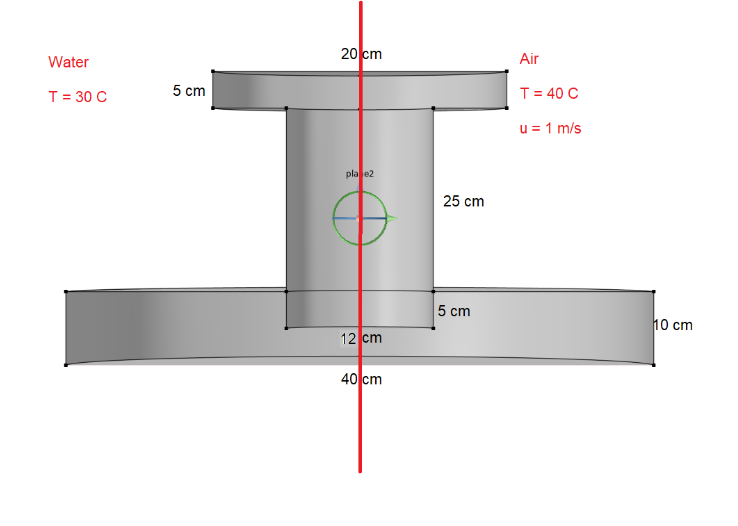
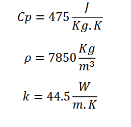
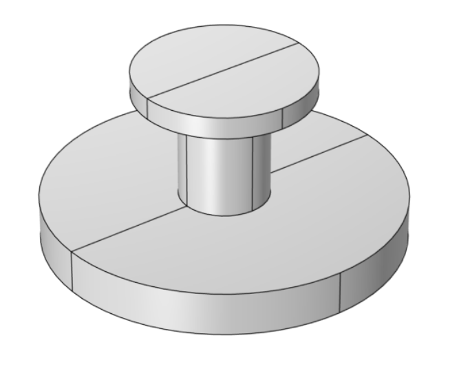
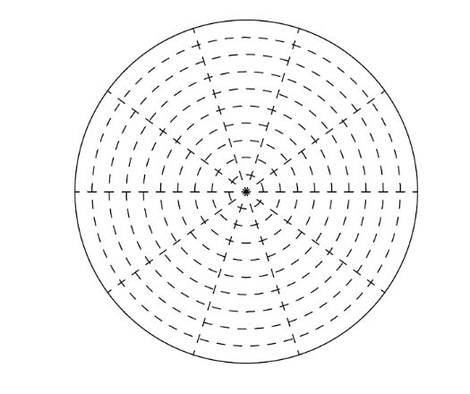

# Heat-transfer-Fin-2-Dimensionall
This project focuses on the simulation and coding of a fin to analyze its temperature distribution in two dimensions. The two-dimensional approach simplifies the problem while still providing insightful results. For a more advanced three-dimensional simulation, please refer to a separate project I have worked on.

**In this project, we intend to investigate heat transfer in two-dimensional space and cylindrical coordinates.**
**Consider a cylindrical copper fin with a base of 20 cm and a steel disk with a diameter of 40 cm. The overall objective of this project is to investigate the heat transfer from this fin to the disk below it. This assembly is located on the right half in the vicinity of air with a temperature of 40 degrees Celsius and a velocity of 1 meter per second, and on the left half in contact with water with a temperature of 30 degrees Celsius. Assume that the air and water have a large volume and therefore during the process Do not change temperature.**

**You can find the required properties for copper from the references, but the properties related to the disc steel are as described below:**

**And also you can see the 3 Dimensional picture of this Fin:**

**Desires:**
  - 1. First, assume that the fin base, the 20 cm cross-sectional surface, has a constant temperature of 35 degrees Celsius, and the bottom surface of the steel disk, i.e. the 40 cm cross-sectional surface, is insulated. On both sides, there are air and water according to the problem description. Under these conditions, calculate the temperature of the nodes in the base conditions and draw the temperature profile. Then, at a distance of 5 cm from the top surface of the disk, draw the exact bottom layer of the rubber fin according to the radius. To draw In the diagram, consider the meshes associated with angles 0 and 180.For the next mesh, consider a square mesh with a side length of 1 mm throughout the figure.
For the next mesh, divide the angle of the complete circle into 10 parts and mesh the radii with a length of 2 cm and a length of 2.5 cm. For example, in the figure below, a 40 cm cross-section has been trimmed:

      
