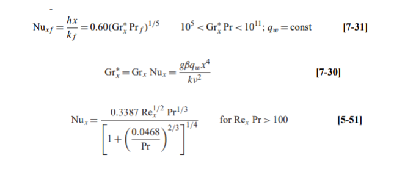
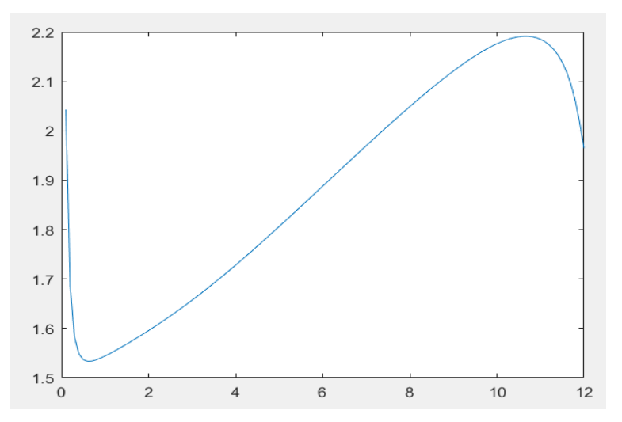
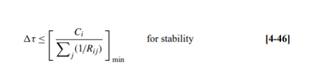
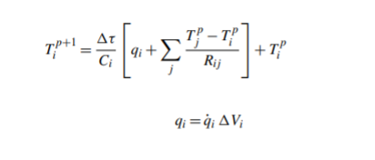
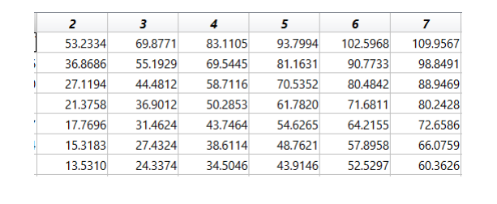
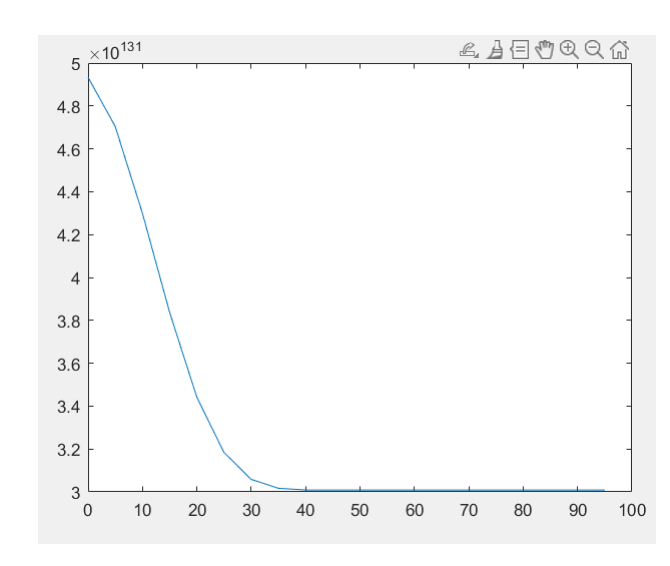

**To better understand the topic and process, I would like to first explain with a shape I drew in Paint:**

**As the surface of the rectangle is concave at the bottom and is tangent to the upper rectangle from above. Our system is exposed to water at a temperature of 30 degrees Celsius from the left and to air at a speed of 1 m/s and a temperature of 40 degrees Celsius from the right. This topic explains to us from the beginning that we have two types of heat transfer: free and forced convection, where free convection occurs from the left and forced convection occurs from the right. The reason for this is that the air that hits the object from the right has a velocity that would cause this phenomenon to occur, but the water from the left is in free convection and does not have any acceleration that would lead to the occurrence of the forced convection phenomenon.**

**First part:**
  - 1. In this section, the base of the fin is assumed to be at a constant temperature and its value is equal to 35 degrees Celsius. We calculate the value of h(heat transfer coefficient) from the Nusselt equation. The following formulas are used for this:
    
    

  - 2. Also you can see the code of this part in amir_hajibeygi_400102458_partone.I have plotted The Temperature profile:

    

**Second part:**
  -  1. In this section, instead of the constant temperature assumption, the constant flux assumption is used. The conditions in this section are unsteady and depend on time. Now, we will use the unsteady formula for it and for each stage with a specific time step, we will use the convergence condition for that time step. As mentioned, we will obtain the time step from the convergence condition:
     

  - 2. Based on the answers in this section, we have taken the time step to be 5 seconds. Now that the time step has been obtained, we will introduce the required formulas:
   
       
     

  - 3. Our assumption in this question is that the existence of the upper rectangle has been ignored and only the middle and bottom have been analyzed:

     
**Third part:**
  - 1. In this section, we need to obtain the time at which the minimum temperature in the system reaches 48 degrees Celsius, based on which we can obtain the maximum temperature at this time and draw a graph for the node for which the maximum temperature occurred at that time:

    
