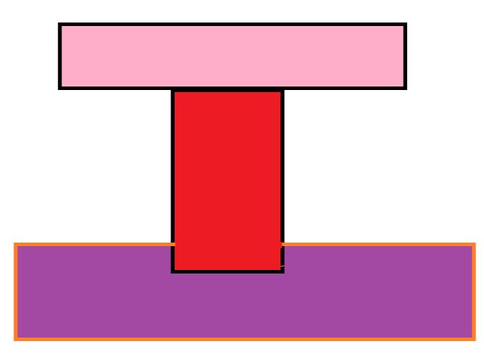

**To better understand the topic and process, I would like to first explain with a shape I drew in Paint:**

**As the surface of the rectangle is concave at the bottom and is tangent to the upper rectangle from above. Our system is exposed to water at a temperature of 30 degrees Celsius from the left and to air at a speed of 1 m/s and a temperature of 40 degrees Celsius from the right. This topic explains to us from the beginning that we have two types of heat transfer: free and forced convection, where free convection occurs from the left and forced convection occurs from the right. The reason for this is that the air that hits the object from the right has a velocity that would cause this phenomenon to occur, but the water from the left is in free convection and does not have any acceleration that would lead to the occurrence of the forced convection phenomenon.**

**Now that the overall shape is in place, let's go to the dimensions of the rectangles, which are 30*12 cm for the top rectangle, 10*40 cm for the bottom rectangle, and 5*20 cm for the top. The material of the rectangle and the surface is steel, and the bottom and top are copper. The values ​​​​regarding copper and steel are as follows in the table below:**
